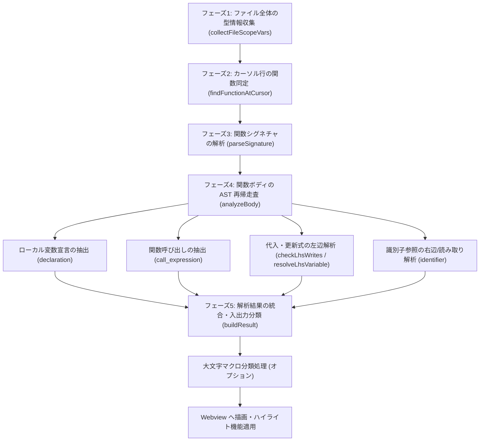
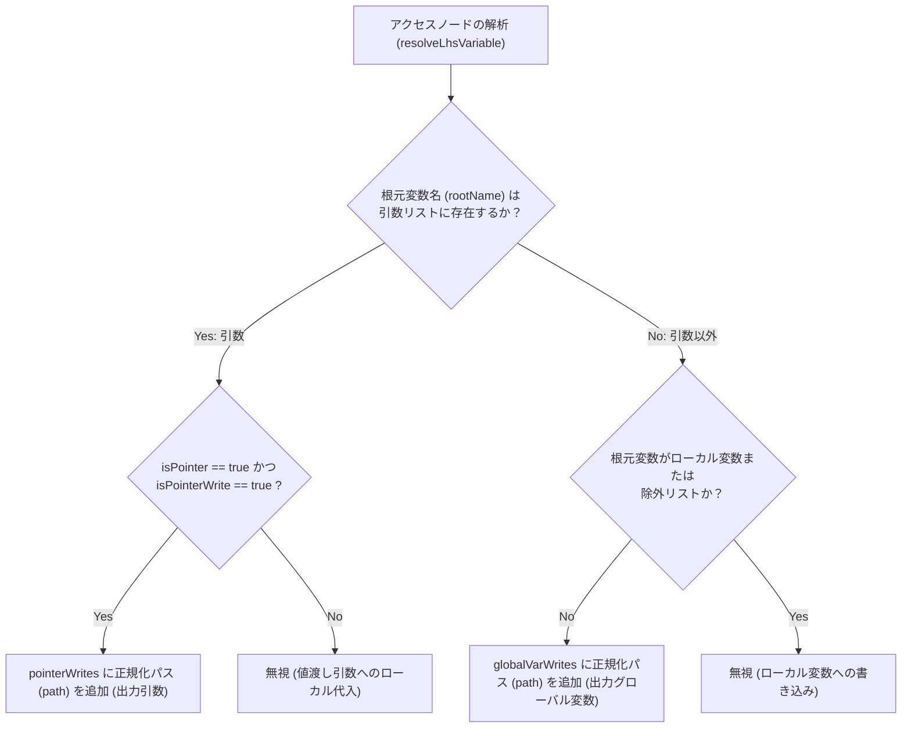
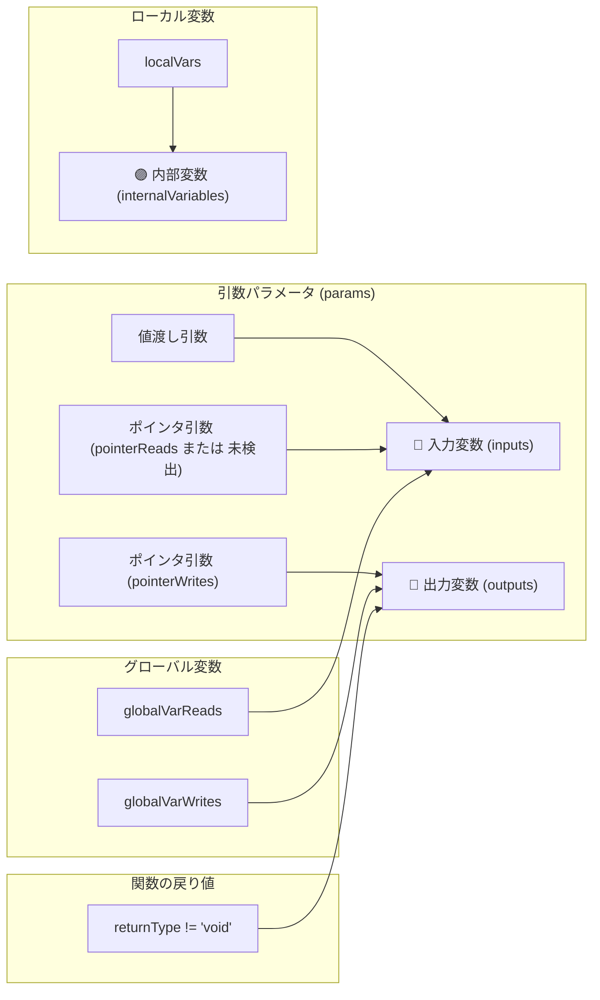

# C Function Analyzer 関数解析・分類 技術仕様書

本ドキュメントは、**C Function Analyzer** 拡張機能が C 言語の関数を解析し、変数や関数呼び出しをどのように分類・抽出しているか（データフロー・構文解析ロジック）を詳細に説明します。

---

## 概要

本拡張機能は、C 言語ソースファイル（`.c`, `.h`）に対して [web-tree-sitter](https://github.com/tree-sitter/tree-sitter)（C 言語用 WASM）による構文解析（AST: 抽象構文木）を実行し、カーソル位置にある関数定義を解析して以下のカテゴリに分類・表示します。

| 分類 | 項目名 | 概要 | 主な判定条件 |
|---|---|---|---|
| 🔵 **入力変数** | `inputs` | 関数内で参照（読み取り）される変数 | 値渡し引数、ポインタ参照される引数、読み取りが行われるグローバル変数 |
| 🔴 **出力変数** | `outputs` | 関数外へ影響を与える書き込み変数 / 戻り値 | ポインタ経由で書き込まれる引数、書き込みが行われるグローバル変数、関数の戻り値 |
| 🟣 **内部変数** | `internalVariables` | 関数内部で宣言・使用されるローカル変数 | 関数ボディ内で `declaration` として定義されたローカル変数 |
| 🟢 **呼び出し関数** | `calledFunctions` | 関数内部で直接呼び出されている関数 | `call_expression` で呼び出される関数名（小文字混じり） |
| 🟠 **マクロ変数** | `macroVariables` | マクロとして定義・参照されている変数 | 大文字のみのグローバル変数（`classifyAllUppercaseAsMacros` 有効時） |
| 🟡 **マクロ関数** | `macroFunctions` | マクロ関数として呼び出されている項目 | 大文字のみの呼び出し関数（`classifyAllUppercaseAsMacros` 有効時） |

---

## 解析の全体フロー



### 実装との対応

各フェーズは `src/analyzer.ts` の同名関数に1対1で対応しており、`analyzeCFunction` はこれらを順に呼び出すだけの薄い関数です。

| フェーズ | 関数名 |
|---|---|
| 1 | `collectFileScopeVars` |
| 2 | `findFunctionAtCursor` |
| 3 | `parseSignature` |
| 4 | `analyzeBody` |
| 5 | `buildResult` |

---

## フェーズ 1: ファイルスコープ（グローバル）型情報の収集

関数解析に先立ち、ファイル全体の AST ルートノードから直下の `declaration`（変数宣言）をスキャンし、グローバル変数の名前と型のマッピング（`fileScopeVars`）を作成します。

```c
int global_counter = 0;              // name: "global_counter", type: "int"
struct Config global_cfg;            // name: "global_cfg", type: "struct Config"
struct Data { int x; } global_data;  // name: "global_data", type: "struct Data" (インライン定義のクレンジング後)
int (*handler)(int);                 // name: "handler",     type: "int*"       (関数ポインタ変数)
int prototype(int);                  // 関数プロトタイプ宣言のため登録されない
```

- **型名クレンジング** (`cleanTypeText`): `struct Data { ... }` のようなインライン構造体定義が含まれる場合、`{` より前の型名部分（`struct Data`）のみを取り出して型として記録します。改行や連続する空白も単一の空白へ正規化します。この処理は**ファイルスコープ・ローカル変数の双方に適用**されます。
- **関数プロトタイプ宣言の除外**: 宣言が `function_declarator` を経由する場合、それが変数宣言か関数プロトタイプかを**ポインタ深さ (`pointerDepth`) で判別**します。
  - `int prototype(int);` → `pointerDepth == 0` のため**変数ではない**と判定し、登録しません。
  - `int (*handler)(int);` → `pointerDepth == 1`（`parenthesized_declarator` 内の `pointer_declarator` を経由）のため**関数ポインタ変数**として登録します。

なお、変数宣言のスキャン処理（`collectDeclaredVars`）はファイルスコープとローカル変数で共通化されており、カンマ区切りの複数宣言・初期化子付き宣言・配列・多重ポインタ・関数ポインタ宣言に対応します。

---

## フェーズ 2: カーソル位置の関数同定

ユーザーがエディタ上でカーソルを置いている行（`cursorLine`）が含まれる `function_definition` ノードを特定します。

- **探索方法**: カーソル行の先頭位置から `descendantForPosition` でノードを取得し、そこから**親方向へ辿って**最も近い `function_definition` を探します。AST 全体を走査しないため探索コストは木の深さに比例します。また、`#ifdef` などのプリプロセッサ条件ブロック内に入れ子になった関数定義も同じ仕組みで同定できます。
- **シグネチャ位置判定**: 関数の戻り値型の開始行から、引数リストの閉じ括弧 `)`（`declaratorNode.endPosition.row`）までの行範囲内にカーソルがある場合のみ解析を実行します（関数ボディの中央などで実行された場合はスキップされます）。

---

## フェーズ 3: 関数シグネチャの解析

### 3.1 宣言子の解決 (`resolveDeclarator`)

関数名・引数名・変数名の取得はすべて `resolveDeclarator` に集約されており、`declarator` ノードを再帰的に深掘りして以下を返します。

| 返却値 | 内容 |
|---|---|
| `name` | 宣言されている識別子名 |
| `pointerDepth` | ポインタ宣言（`*`）の深さ |
| `arrayDepth` | 配列宣言（`[]`）の深さ |
| `ownerFunctionDeclarator` | 識別子に最も近い `function_declarator` |

`pointer_declarator` / `array_declarator` / `parenthesized_declarator` / `function_declarator` のいずれの入れ子にも対応します（`parenthesized_declarator` は `declarator` フィールドを持たないため、`(` の次の子へ進みます）。

### 3.2 関数名と戻り値の型
- `resolveDeclarator` で関数識別子と `pointerDepth` を取得し、戻り値型の末尾にポインタ深さ分のアスタリスクを付与します。
- 関数の宣言型テキストから修飾子（`static`, `extern`, `inline`）を取り除き、クレンジングされた戻り値型（例: `int*`, `void`）を決定します。

### 3.3 引数リスト (`params`)

**引数リストの取得元**: `resolveDeclarator` が返す `ownerFunctionDeclarator`（＝関数名の識別子に最も近い `function_declarator`）の `parameters` フィールドを使用します。

これは関数ポインタを返す関数で外側の引数リストを誤読しないためです。

```c
void (*get_handler(int id))(char *msg)
//    ~~~~~~~~~~~~~~~~~~~~  内側の function_declarator → (int id)  ← 正しい引数リスト
//   ~~~~~~~~~~~~~~~~~~~~~~~~~~~~~~~~~ 外側の function_declarator → (char *msg)
```

各 `parameter_declaration` について以下を解析します。

- **型テキストの切り出し**: `declarator` の開始位置（`startIndex`）までを切り出します。文字列検索を使うと、引数名が型名に含まれる場合（例: `struct data data`）に誤った位置で切れてしまうためです。
- **ポインタ判定**: `pointerDepth > 0`（`int *p`）または `arrayDepth > 0`（`int arr[]`）の場合に **`isPointer = true`**（＝デレファレンスによる書き込みが可能）として記録します。
- **型名の表示**: 型名の末尾にポインタ深さ分のアスタリスクを付与します（配列はポインタ1段として扱います）。例: `int *p` → `int*`、`int **pp` → `int**`、`int arr[]` → `int*`。

---

## フェーズ 4: 関数ボディのトラバース解析

関数ボディ（`compound_statement`）内のすべての AST ノードを再帰走査 (`walk`) し、変数の宣言・参照・書き込みを判定します。

### 4.1 ローカル変数の抽出
`declaration` ノードから変数名と型を取り出し、`localVars` に登録します（多重ポインタや配列宣言に対応）。

### 4.2 関数呼び出しの抽出
`call_expression` の関数識別子を `calledFunctionsSet` に登録します（関数ポインタ経由の呼び出しを除く）。

---

### 4.3 代入式および更新式の書き込み判定 (`checkLhsWrites`)

代入式（`assignment_expression`）の左辺（`left`）およびインクリメント/デクリメント式（`update_expression`）の対象（`argument`）に対して、`resolveLhsVariable` を実行します。

#### `resolveLhsVariable` による構文木の解読およびアクセスパス正規化
左辺またはアクセス式の構文木を深掘りし、根元の識別子名（`rootName`）、**アクセスパス文字列（`path`）**、およびデレファレンス（書き込みアクセス）の有無（`isPointerWrite`）を解決します。

アクセスパス（`path`）は、**配列の添字内容を空の `[]` に正規化**した文字列として構築されます。

| 入力コード例 | 根元識別子 (`rootName`) | アクセスパス (`path`) | `isPointerWrite` の判定 |
|---|---|---|---|
| `hogestruct[0].a = 100;` | `hogestruct` | `hogestruct[].a` | `true` (配列アクセス) |
| `grid[1][2] = 20;` | `grid` | `grid[][]` | `true` (配列アクセス) |
| `var_ptr->sub.member = 30;` | `var_ptr` | `var_ptr->sub.member` | `true` (アロー演算子) |
| `global_val = 10;` | `global_val` | `global_val` | `false` |

#### 書き込み先の分類ロジック (`checkLhsWrites`)



---

### 4.4 識別子 (identifier) の参照・読み取り判定

AST 内で `identifier` ノードが出現した際、それが読み取り（入力）として使われているかを判定します。

#### スキップ条件
以下の場合、単なる名前の宣言や構造体メンバ指定であるためスキップします。
- `field_expression` の右側（`obj.member` の `member`）
- `parameter_declaration`, `declaration`, `function_declarator` の名称部分

#### LHS（書き込み先）判定 (`isLhsNode`)
ノードが単なる代入の左辺 (`left`) である場合は読み取り判定から除外します。
- **例外（複合代入・インクリメント）**: `+=`, `-=` などの複合代入演算子、または `++`, `--` の更新式に位置する場合は `isLhsNode = false` とし、**「読み取り（入力）」と「書き込み（出力）」の両方にカウント**します。

#### 分類適用
1. **ポインタ引数**: `isLhsNode` でなければ `pointerReads` に追加。
2. **グローバル変数**: 引数・ローカル変数・呼び出し関数・ブラックリスト（`NULL`, `true` 等）のいずれにも該当せず、`isLhsNode` でなければ `globalVarReads` に追加。

---

## フェーズ 5: 解析結果の統合と最終分類

収集されたデータをもとに、各出力カテゴリを作成します。



### 5.1 マクロ分類 (`classifyAllUppercaseAsMacros`)
VS Code の設定 `c-function-analyzer.classifyAllUppercaseAsMacros` が有効な場合、以下のルールで分離します。
- **呼び出し関数**: 英大文字・数字・アンダースコアのみで構成される場合（例: `LOG_ERROR()`）、`macroFunctions` に分離。
- **グローバル変数**: 大文字のみの場合（例: `MAX_BUFFER_SIZE`）、`macroVariables` に分離（型名は `macro (推定)`）。

---

## 判定ロジックの具体例

### 例 1: 複合代入とポインタのインクリメント

```c
int global_val = 0;

void process_data(int *ptr) {
    global_val += 5;   // global_val は += のため「入力」と「出力」の両方に分類
    (*ptr)++;          // ptr は (*ptr)++ のため「入力引数」と「出力引数」の両方に分類
}
```

### 例 2: グローバル構造体配列への代入

```c
struct SensorData { int val; };
struct SensorData sensors[10];

void update_sensor() {
    sensors[0].val = 100;
}
```
1. `sensors[0].val = 100` の左辺を `resolveLhsVariable` で解析。
2. 配列アクセス `[0]` を検出し `isPointerWrite = true`, `name = "sensors"`。
3. `sensors` は引数リストに存在しないため `else` ブロック（グローバル変数判定）へ到達。
4. ローカル変数ではないため、`globalVarWrites` に追加され、**`outputs`（グローバル変数への書き込み）として正しく検出**。

---

## 除外ブラックリスト (`EXCLUDE_LIST`)

グローバル変数の自動判定時、以下の C 言語標準予約語やシステムマクロは自動的に除外されます。
- `NULL`, `TRUE`, `FALSE`, `true`, `false`
- `stdin`, `stdout`, `stderr`
- `sizeof`, `countof`
- 基本型キーワード (`int`, `char`, `float`, `double`, `void`, `struct`, `union`, `enum` など)
