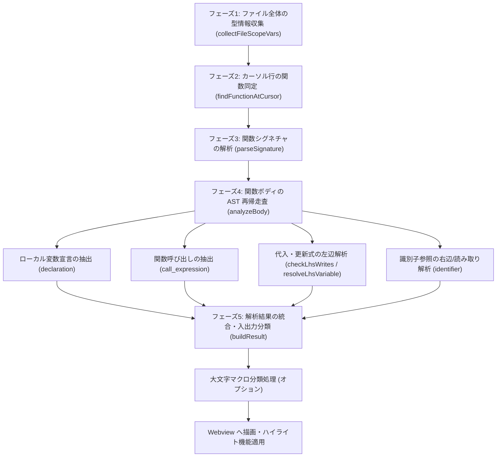
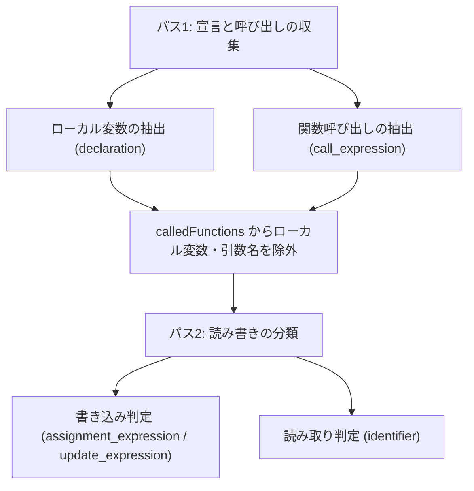
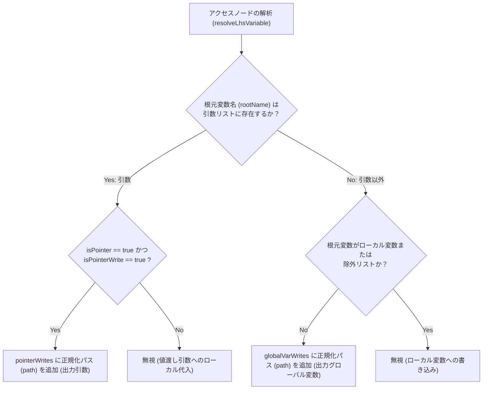
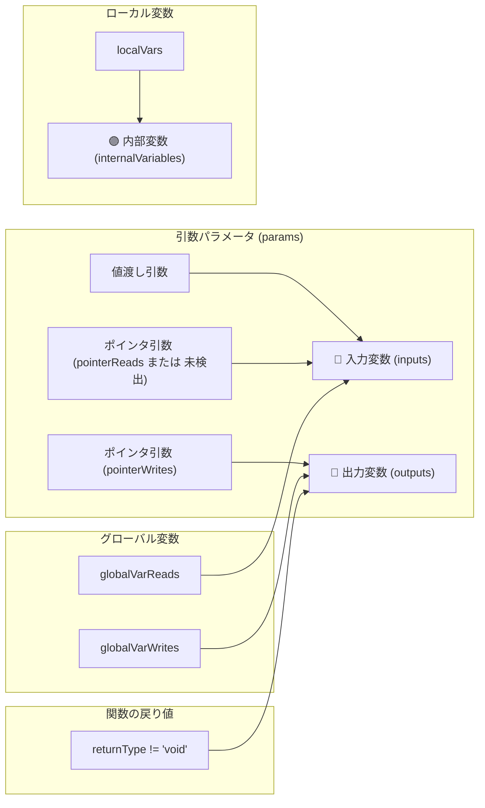
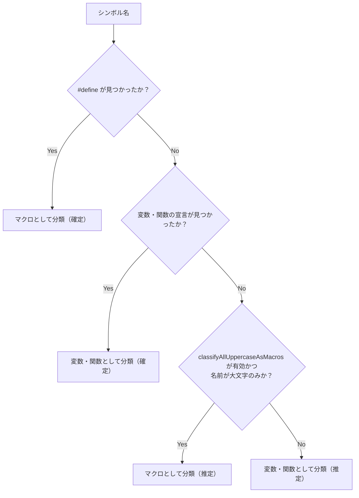

# C Function Analyzer 関数解析・分類 技術仕様書

本ドキュメントは、**C Function Analyzer** 拡張機能が C 言語の関数を解析し、変数や関数呼び出しをどのように分類・抽出しているか（データフロー・構文解析ロジック）を詳細に説明します。

---

## 概要

本拡張機能は、C 言語ソースファイル（`.c`, `.h`）に対して [web-tree-sitter](https://github.com/tree-sitter/tree-sitter)（C 言語用 WASM）による構文解析（AST: 抽象構文木）を実行し、カーソル位置にある関数定義を解析して以下のカテゴリに分類・表示します。

| 分類 | 項目名 | 概要 | 主な判定条件 |
|---|---|---|---|
| 🔵 **入力変数** | `inputs` | 関数内で参照（読み取り）される変数 | 値渡し引数、ポインタ参照される引数、読み取りが行われるグローバル変数 |
| 🔴 **出力変数** | `outputs` | 関数外へ影響を与える書き込み変数 / 戻り値 | ポインタ経由で書き込まれる引数、書き込みが行われるグローバル変数、関数の戻り値 |
| 🟣 **内部変数** | `internalVariables` | 関数内部で宣言・使用されるローカル変数 | 関数ボディ内で `declaration` として定義されたローカル変数 |
| 🟢 **呼び出し関数** | `calledFunctions` | 関数内部で直接呼び出されている関数 | `call_expression` で呼び出される関数名（小文字混じり） |
| 🟠 **マクロ変数** | `macroVariables` | マクロとして定義・参照されている変数 | 大文字のみのグローバル変数（`classifyAllUppercaseAsMacros` 有効時） |
| 🟡 **マクロ関数** | `macroFunctions` | マクロ関数として呼び出されている項目 | 大文字のみの呼び出し関数（`classifyAllUppercaseAsMacros` 有効時） |

---

## 解析の全体フロー



### 実装との対応

各フェーズは `src/analyzer.ts` の同名関数に1対1で対応しており、`analyzeCFunction` はこれらを順に呼び出すだけの薄い関数です。

| フェーズ | 関数名 |
|---|---|
| 1 | `collectFileScopeSymbols` / `collectIncludedSymbols` |
| 2 | `findFunctionAtCursor` |
| 3 | `parseSignature` |
| 4 | `analyzeBody` |
| 5 | `buildResult` |

---

## フェーズ 1: ファイルスコープ（グローバル）型情報の収集

関数解析に先立ち、ファイル全体の AST ルートノードから直下の `declaration`（変数宣言）をスキャンし、グローバル変数の名前と型のマッピング（`fileScopeVars`）を作成します。

```c
int global_counter = 0;              // name: "global_counter", type: "int"
struct Config global_cfg;            // name: "global_cfg", type: "struct Config"
struct Data { int x; } global_data;  // name: "global_data", type: "struct Data" (インライン定義のクレンジング後)
int (*handler)(int);                 // name: "handler",     type: "int*"       (関数ポインタ変数)
int prototype(int);                  // 関数プロトタイプ宣言のため登録されない
```

- **型名クレンジング** (`cleanTypeText`): `struct Data { ... }` のようなインライン構造体定義が含まれる場合、`{` より前の型名部分（`struct Data`）のみを取り出して型として記録します。改行や連続する空白も単一の空白へ正規化します。この処理は**ファイルスコープ・ローカル変数の双方に適用**されます。
- **関数プロトタイプ宣言の除外**: 宣言が `function_declarator` を経由する場合、それが変数宣言か関数プロトタイプかを**ポインタ深さ (`pointerDepth`) で判別**します。
  - `int prototype(int);` → `pointerDepth == 0` のため**変数ではない**と判定し、登録しません。
  - `int (*handler)(int);` → `pointerDepth == 1`（`parenthesized_declarator` 内の `pointer_declarator` を経由）のため**関数ポインタ変数**として登録します。

なお、変数宣言のスキャン処理（`collectDeclaredVars`）はファイルスコープとローカル変数で共通化されており、カンマ区切りの複数宣言・初期化子付き宣言・配列・多重ポインタ・関数ポインタ宣言に対応します。

### 配列の次元の表記ルール

配列の次元は**名前と型名のどちらか一方にのみ**表示します。両方に出すと冗長になるためです。

| 条件 | 次元の表示先 | 例 |
|---|---|---|
| 添字でアクセスされている | **名前**（アクセスパス） | 名前 `hoge[N]` / 型 `int` |
| 添字なしで参照されている | **型名** | 名前 `table` / 型 `int[8]` |
| 内部変数（名前は宣言名そのもの） | **型名** | 名前 `local_arr` / 型 `int[5]` |

#### 構造体メンバの型解決 (`resolveAccessPath`)

アクセスパスを区切り文字（`.` と `->`）で分割し、構造体定義を辿って**最終的に参照しているメンバの型**を決定します。

```
var_ptr->sub.member
  ↓ 根元 var_ptr の型 = struct Outer*
  ↓ ポインタ表記を除去 → struct Outer
  ↓ struct Outer のメンバ sub の型 = struct Sub
  ↓ struct Sub のメンバ member の型 = int
  → 表示する型 = int
```

| アクセスパス | 宣言 | 表示される型 |
|---|---|---|
| `tbl[5].id` | `HogeStruct tbl[5]` | `int` |
| `var_ptr->sub.member` | `struct Outer *var_ptr` | `int` |
| `cfg.name[8]` | `char name[8]` | `char` |
| `cfg.name`（添字なし） | `char name[8]` | `char[8]` |
| `cfg.ptr` | `int *ptr` | `int*` |

構造体定義やメンバが見つからない場合は、**根元の変数の型をそのまま表示**します（無理に解決するより、根元の型が見えている方が手がかりになるため）。ポインタ引数のメンバアクセス（`data->id`）にも同じ解決を適用します。

#### アクセスパスへの次元の反映

添字でアクセスされた変数のアクセスパスは、いったん `[]` に正規化された後、**宣言された次元で置き換え**られます。置き換えは**セグメントごと**に行われ、各セグメントが指す変数・メンバの次元が使われます（`tbl[].id` の `[]` には `tbl` の次元が、`cfg.name[]` の `[]` にはメンバ `name` の次元が入ります）。

| 宣言 | コード上の使用 | 表示される名前 |
|---|---|---|
| `int hoge[N];` | `hoge[2]`、`hoge[i]` | `hoge[N]` |
| `int grid[3][4];` | `grid[1][2]` | `grid[3][4]` |
| `HogeStruct tbl[5];` | `tbl[0].id` | `tbl[5].id` |
| `extern int unsized[];` | `unsized[0]` | `unsized[]`（次元が不明） |
| `int *ptr;` | `ptr[0]` | `ptr[]`（配列宣言ではない） |

添字の値（`[2]` と `[i]`）によらず同じ表示名になるため、**同一変数への複数のアクセスは1件に集約**されます。

#### 型名の表記

| 宣言 | 型名の表示（添字なし参照・内部変数の場合） |
|---|---|
| `int plain` | `int` |
| `int *ptr` | `int*` |
| `int hoge_array[5]` | `int[5]` |
| `int grid[3][4]` | `int[3][4]` |
| `char buf[]` | `char[]` |
| `char sized[MAX_LEN]` | `char[MAX_LEN]` |
| `int *ptrs[8]` | `int*[8]` |

一方、**引数の配列はポインタ表記（`int*`）**とします。C言語の仕様上、引数の配列はポインタへ減衰するためです。

```c
void f(int param_arr[5])   // 型は int*  （減衰するため）
int  local_arr[5];         // 型は int[5]（減衰しない）
```

#### 名前フィールドは機能的なフィールドである

名前フィールドはハイライト検索の正規表現とコピー対象を兼ねます。そのため、名前に添字を含める場合は `buildHighlightRegex` が**添字の中身によらず任意の添字にマッチ**する必要があります（`hoge[N]` という表示名でコード上の `hoge[2]` を見つけられなければならない）。

同じ理由から、**内部変数の名前には配列の次元を付けません**。内部変数の名前は宣言名そのもの（`hoge_array`）であり、ここに `[]` を付けると `memcpy(dst, hoge_array, n)` や `sizeof(hoge_array)` のような添字を伴わない参照がハイライトから漏れてしまいます。

### ファイルスコープの走査範囲 (`forEachFileScopeNode`)

宣言の走査は、AST ルート直下だけでなく**プリプロセッサ条件ブロックの内側も透過的に降りて**行います（`preproc_ifdef` / `preproc_if` / `preproc_elif` / `preproc_else`）。関数ボディの内側には入りません。

これはインクルードガードに対応するためです。C言語ヘッダのほぼ全てが以下の形をとるため、この対応がないとヘッダ内の宣言を一切収集できません。

```c
#ifndef CONFIG_H        // ← 以下の宣言は preproc_ifdef の子になる
#define CONFIG_H
extern int shared_counter;
#endif
```

条件の真偽は評価せず、`#if` / `#elif` / `#else` のいずれに書かれた宣言もすべて収集します。

### 構造体・共用体定義の収集 (`collectStructDefinitions`)

`struct_specifier` / `union_specifier` のうち **`body`（`field_declaration_list`）を持つもの**を定義とみなし、メンバ名と型を収集します（`struct Sub sub;` のような型参照は `body` を持たないため対象外です）。

メンバの解析には変数宣言と同じ `collectDeclaredVars` を使用します。`field_declaration` は `declaration` と同じ構造（`type` + `declarator`）であるためです。配列メンバ（`char name[8]`）やポインタメンバ（`int *ptr`）も同じ仕組みで解決されます。

登録キーは**タグ名と typedef 名の双方**を用意し、どちらの表記からも引けるようにします。

| 宣言 | 登録キー |
|---|---|
| `struct Config { int mode; };` | `struct Config` |
| `union Value { int i; };` | `union Value` |
| `typedef struct { int id; } HogeStruct;` | `HogeStruct` |
| `typedef struct Tag { int x; } TagAlias;` | `struct Tag` と `TagAlias` の両方 |
| `struct Data { int x; } global_data;` | `struct Data` |

関数ボディ内で定義されたローカルな型は収集対象外です。

### 関数名の収集 (`collectFileScopeFunctions`)

変数の型情報とは別に、ファイル内で宣言・定義されている**関数の名前**も収集します。

| 対象 | 例 |
|---|---|
| 関数定義 | `int helper(int x) { ... }` |
| 関数プロトタイプ宣言 | `int helper(int x);` |

これはフェーズ4で、関数名が値として参照されているだけの場合にグローバル変数と誤分類しないための除外リストとして使用します（詳細は「4.4 識別子の参照・読み取り判定」を参照）。

### マクロ定義の収集 (`collectMacros`)

`#define` からマクロ名・定義値・定義位置を収集します。オブジェクト形式（`#define MAX 10`）と関数形式（`#define SQ(x) ((x)*(x))`）の双方に対応します。

定義値は AST 上で**行末までの生テキスト**として得られるため、末尾に書かれた行コメントが含まれます。そのため `normalizeMacroValue` でコメントを除去してから空白を正規化します。文字列リテラル・文字リテラルの内外を判定しながら走査するため、`#define URL "http://example.com"` の `//` はコメントとして扱いません。

なお、小文字を含むマクロは大文字マクロ分類の対象外となり「マクロ変数」ではなく入出力変数として分類されますが、変数宣言が見つからない場合はマクロ定義を参照して定義値と定義位置を表示します。

型名バッジには次のように表示されます。

| 状態 | 表示 |
|---|---|
| 値を持つマクロ | `macro (10)`（24文字を超える値は末尾を省略） |
| 値を持たないマクロ | `macro` |
| 定義が見つからない | `macro (推定)` |

### インクルードファイルの探索 (`collectIncludedSymbols`)

`#include "..."` を再帰的に辿り、ヘッダ内で宣言された変数・関数・マクロを収集します。これにより、従来 `global (推定)` と表示されていたグローバル変数が実際の型で表示され、定義位置へのジャンプも可能になります。

ファイル読み込みは環境依存の処理であるため、解析ロジックからは分離し `IncludeResolver` として**注入**します。実装は `src/includeResolver.ts` の `FileIncludeResolver` が提供します。

```typescript
export interface IncludeResolver {
    resolve(includePath: string, fromFilePath?: string): ResolvedInclude | null;
}
```

この構成により、`analyzer.ts` は `web-tree-sitter` のみに依存する状態を保っており、テストではメモリ上の疑似リゾルバを注入して実ファイルなしで検証しています。

#### 探索の仕様

| 項目 | 内容 |
|---|---|
| 対象 | `#include "..."`（`string_literal`）のみ。`#include <...>`（`system_lib_string`）は対象外 |
| 探索パス | ①インクルード元ファイルのディレクトリ ②設定 `includePaths`（記述順、直下のみ） ③各ワークスペースフォルダの直下 |
| フォールバック | ①〜③で見つからない場合、設定 `searchWorkspaceByFileName` が有効ならワークスペース内をファイル名で検索 |
| 除外 | 設定 `excludePaths` に指定したディレクトリは配下ごと対象外（再帰展開でも辿りません） |
| 同名ファイル | 最初に見つかったものを採用し、他にも候補が実在する場合は解析結果に注意を表示します |
| 再帰 | 辿る。深さ上限は 8 段 |
| 循環検出 | 解決済みファイルパスの集合で検出し、同一ファイルは一度だけ展開 |
| 優先順位 | 解析対象ファイル自身の宣言が最優先。インクルード側は未登録のシンボルのみを補う |
| 失敗時 | 解決できないインクルードやリゾルバの例外は無視し、解析を継続する |
| キャッシュ | ファイルパスと更新時刻で管理し、同一セッション中は再パースしない |

#### 探索候補パスの構築 (`buildIncludeCandidates`)

候補パスの組み立ては `src/includePaths.ts` の純関数に分離しており、ファイルシステムや VS Code API に触れずにテストできます。設定 `includePaths` の相対パスは各ワークスペースフォルダからの相対として解決し、絶対パスはそのまま使用します。指定したディレクトリの直下のみを探し、同一パスが複数回現れた場合は重複を除去します。

```
proj/
├─ src/main.c        →  #include "types.h"
└─ include/types.h        includePaths: ["include"] で解決可能になる
```

設定値は解決のたびに読み取るため、変更は再起動なしで反映されます。

#### ファイル名検索 (`buildFileNameSearchCandidates`)

探索パスで見つからなかった場合のフォールバックです。ワークスペース内のファイルを**ファイル名で引ける索引**（`ファイル名 → 絶対パス一覧`）から候補を求めます。ヘッダが多数のディレクトリに分散していても、探索パスを列挙せずに解決できます。

| 項目 | 内容 |
|---|---|
| 実行条件 | 探索パスで1件も見つからなかった場合のみ |
| 一致条件 | パスの末尾がインクルード記述と一致すること（`sub/types.h` はそのディレクトリ構成を要求） |
| 優先順位 | ディレクトリ階層の浅い順 → 同じ深さではパス順 |
| 除外 | `excludePaths` 配下、ドットで始まるディレクトリ、`node_modules`、`out` |
| 対象拡張子 | `.h` `.hpp` `.hh` `.hxx` `.inc` `.c` `.cpp` `.cc` `.cxx` |
| 上限 | 索引に登録するファイル数は 50000 件 |

索引の構築は `includeResolver.ts` が担い、候補の選択と並び替えは `includePaths.ts` の純関数として分離しているためテストできます。索引は初回利用時に構築し、`FileSystemWatcher` でファイルの作成・削除を検知して破棄します。

同名ファイルが複数見つかった場合は、通常の探索と同じく最初の1件を採用し、解析結果に注意を表示します。

#### 制約
- ファイルは保存済みの内容を読み込むため、エディタ上の未保存の編集は反映されません。
- `typedef` は展開しません（`typedef unsigned char BYTE;` があっても `BYTE g_flags;` は `BYTE` と表示します）。

---

## フェーズ 2: カーソル位置の関数同定

ユーザーがエディタ上でカーソルを置いている行（`cursorLine`）が含まれる `function_definition` ノードを特定します。

- **探索方法**: カーソル行の先頭位置から `descendantForPosition` でノードを取得し、そこから**親方向へ辿って**最も近い `function_definition` を探します。AST 全体を走査しないため探索コストは木の深さに比例します。また、`#ifdef` などのプリプロセッサ条件ブロック内に入れ子になった関数定義も同じ仕組みで同定できます。
- **シグネチャ位置判定**: 関数の戻り値型の開始行から、引数リストの閉じ括弧 `)`（`declaratorNode.endPosition.row`）までの行範囲内にカーソルがある場合のみ解析を実行します（関数ボディの中央などで実行された場合はスキップされます）。

---

## フェーズ 3: 関数シグネチャの解析

### 3.1 宣言子の解決 (`resolveDeclarator`)

関数名・引数名・変数名の取得はすべて `resolveDeclarator` に集約されており、`declarator` ノードを再帰的に深掘りして以下を返します。

| 返却値 | 内容 |
|---|---|
| `name` | 宣言されている識別子名 |
| `pointerDepth` | ポインタ宣言（`*`）の深さ |
| `arrayDepth` | 配列宣言（`[]`）の深さ |
| `arrayDimensions` | 配列の各次元のサイズ（内側から順。`int grid[3][4]` なら `['3', '4']`） |
| `ownerFunctionDeclarator` | 識別子に最も近い `function_declarator` |

`pointer_declarator` / `array_declarator` / `parenthesized_declarator` / `function_declarator` のいずれの入れ子にも対応します（`parenthesized_declarator` は `declarator` フィールドを持たないため、`(` の次の子へ進みます）。

### 3.2 関数名と戻り値の型
- `resolveDeclarator` で関数識別子と `pointerDepth` を取得し、戻り値型の末尾にポインタ深さ分のアスタリスクを付与します。
- 関数の宣言型テキストから修飾子（`static`, `extern`, `inline`）を取り除き、クレンジングされた戻り値型（例: `int*`, `void`）を決定します。

### 3.3 引数リスト (`params`)

**引数リストの取得元**: `resolveDeclarator` が返す `ownerFunctionDeclarator`（＝関数名の識別子に最も近い `function_declarator`）の `parameters` フィールドを使用します。

これは関数ポインタを返す関数で外側の引数リストを誤読しないためです。

```c
void (*get_handler(int id))(char *msg)
//    ~~~~~~~~~~~~~~~~~~~~  内側の function_declarator → (int id)  ← 正しい引数リスト
//   ~~~~~~~~~~~~~~~~~~~~~~~~~~~~~~~~~ 外側の function_declarator → (char *msg)
```

各 `parameter_declaration` について以下を解析します。

- **型テキストの切り出し**: `declarator` の開始位置（`startIndex`）までを切り出します。文字列検索を使うと、引数名が型名に含まれる場合（例: `struct data data`）に誤った位置で切れてしまうためです。
- **ポインタ判定**: `pointerDepth > 0`（`int *p`）または `arrayDepth > 0`（`int arr[]`）の場合に **`isPointer = true`**（＝デレファレンスによる書き込みが可能）として記録します。
- **型名の表示**: 型名の末尾にポインタ深さ分のアスタリスクを付与します（配列はポインタ1段として扱います）。例: `int *p` → `int*`、`int **pp` → `int**`、`int arr[]` → `int*`。

---

## フェーズ 4: 関数ボディのトラバース解析

関数ボディ（`compound_statement`）内の AST ノードを再帰走査 (`walk`) し、変数の宣言・参照・書き込みを判定します。

### 走査は2パス構成

読み書きの分類（パス2）は、**ローカル変数と呼び出し関数の一覧が確定していること**を前提とします。1周で行うと識別子の出現順によって分類結果が変わってしまうため、走査を2周に分けています。



1周で行っていた場合、次のコードで `helper` が「呼び出し関数」と「入力変数」の両方に重複して分類されていました。

```c
void work(void) {
    void (*p)(void) = helper;  // この時点では helper はまだ呼び出しとして未登録
    helper();                  // ここで初めて呼び出しとして登録される
}
```

### 4.1 ローカル変数の抽出（パス1）
`declaration` ノードから変数名と型を取り出し、`localVars` に登録します（多重ポインタや配列宣言に対応）。処理はフェーズ1と共通の `collectDeclaredVars` を使用します。

### 4.2 関数呼び出しの抽出（パス1）
`call_expression` の関数識別子を `calledFunctions` に登録します（関数ポインタ経由の呼び出しを除く）。

収集後、ローカル変数や引数として宣言されている名前（＝関数ポインタ変数の呼び出し）を除外します。

---

### 4.3 代入式および更新式の書き込み判定 (`checkLhsWrites`)

代入式（`assignment_expression`）の左辺（`left`）およびインクリメント/デクリメント式（`update_expression`）の対象（`argument`）に対して、`resolveLhsVariable` を実行します。

#### `resolveLhsVariable` による構文木の解読およびアクセスパス正規化
左辺またはアクセス式の構文木を深掘りし、根元の識別子名（`rootName`）、**アクセスパス文字列（`path`）**、およびデレファレンス（書き込みアクセス）の有無（`isPointerWrite`）を解決します。

アクセスパス（`path`）は、**配列の添字内容を空の `[]` に正規化**した文字列として構築されます。

| 入力コード例 | 根元識別子 (`rootName`) | アクセスパス (`path`) | `isPointerWrite` の判定 |
|---|---|---|---|
| `hogestruct[0].a = 100;` | `hogestruct` | `hogestruct[].a` | `true` (配列アクセス) |
| `grid[1][2] = 20;` | `grid` | `grid[][]` | `true` (配列アクセス) |
| `var_ptr->sub.member = 30;` | `var_ptr` | `var_ptr->sub.member` | `true` (アロー演算子) |
| `global_val = 10;` | `global_val` | `global_val` | `false` |

#### 書き込み先の分類ロジック (`checkLhsWrites`)



---

### 4.4 識別子 (identifier) の参照・読み取り判定

AST 内で `identifier` ノードが出現した際、それが読み取り（入力）として使われているかを判定します。

#### スキップ条件
以下の場合、単なる名前の宣言や構造体メンバ指定であるためスキップします。
- `field_expression` の右側（`obj.member` の `member`）
- `parameter_declaration`, `declaration`, `function_declarator` の名称部分

#### LHS（書き込み先）判定 (`isLhsNode`)
ノードが単なる代入の左辺 (`left`) である場合は読み取り判定から除外します。
- **例外（複合代入・インクリメント）**: `+=`, `-=` などの複合代入演算子、または `++`, `--` の更新式に位置する場合は `isLhsNode = false` とし、**「読み取り（入力）」と「書き込み（出力）」の両方にカウント**します。

#### 分類適用
1. **ポインタ引数**: `isLhsNode` でなければ `pointerReads` に追加。
2. **グローバル変数**: 下表のいずれにも該当せず、`isLhsNode` でなければ `globalVarReads` に追加。

| 除外条件 | 判定対象 | 理由 |
|---|---|---|
| 引数 | `params` | 引数として別途分類済み |
| ローカル変数 | `localVars` | 内部変数として別途分類済み |
| 呼び出し関数 | `calledFunctions` | 呼び出し関数として別途分類済み |
| **ファイル内で宣言された関数** | `fileScopeFunctions` | 関数名は変数ではない（下記参照） |
| ブラックリスト | `EXCLUDE_LIST` | `NULL`, `true` 等の予約語・システムマクロ |

**ファイル内で宣言された関数の除外**は、関数名が値として参照されるだけで呼び出されないケースに対応するものです。

```c
int helper(int x);

void work(void) {
    int (*fp)(int) = helper;  // helper は参照のみで呼び出されない
    int result = fp(1);
}
```

この場合 `helper` は `calledFunctions` に登録されないため、除外しないとグローバル変数の読み取り（入力変数）として誤分類されます。

---

## フェーズ 5: 解析結果の統合と最終分類

収集されたデータをもとに、各出力カテゴリを作成します。



### 5.1 マクロ分類 (`shouldClassifyAsMacro`)

マクロかどうかは、フェーズ1で収集した定義に基づいて判定します。判定の優先順位は次の通りです。



`#define` を変数・関数の宣言より優先するのは、プリプロセッサが先に展開するためです。

| 記述 | 判定 | 型名の表示 |
|---|---|---|
| `#define MAX_LIMIT 100` | マクロ（確定） | `macro (100)` |
| `#define hoge 10` | マクロ（確定。小文字でも） | `macro (10)` |
| `extern int GLOBAL_COUNTER;` | 変数（確定。大文字でも） | `int` |
| `void INIT_ALL(void);` | 関数（確定。大文字でも） | — |
| 定義が見つからない `UNKNOWN_LIMIT` | マクロ（推定） | `macro (推定)` |

設定 `c-function-analyzer.classifyAllUppercaseAsMacros` は、**定義が特定できなかった場合の推定方針のみ**を制御します。定義に基づく判定は推定ではないため、設定の影響を受けません。

システムインクルード（`#include <...>`）は探索対象外のため、標準ライブラリのマクロは推定による判定になります。

---

## 判定ロジックの具体例

### 例 1: 複合代入とポインタのインクリメント

```c
int global_val = 0;

void process_data(int *ptr) {
    global_val += 5;   // global_val は += のため「入力」と「出力」の両方に分類
    (*ptr)++;          // ptr は (*ptr)++ のため「入力引数」と「出力引数」の両方に分類
}
```

### 例 2: グローバル構造体配列への代入

```c
struct SensorData { int val; };
struct SensorData sensors[10];

void update_sensor() {
    sensors[0].val = 100;
}
```
1. `sensors[0].val = 100` の左辺を `resolveLhsVariable` で解析。
2. 配列アクセス `[0]` を検出し `isPointerWrite = true`, `name = "sensors"`。
3. `sensors` は引数リストに存在しないため `else` ブロック（グローバル変数判定）へ到達。
4. ローカル変数ではないため、`globalVarWrites` に追加され、**`outputs`（グローバル変数への書き込み）として正しく検出**。

---

## Webview への描画

解析結果の HTML 生成は `src/webviewHtml.ts`（構造）と `src/webviewStyles.ts`（スタイル）に分離されており、いずれも VS Code API に依存しないためヘッドレスでテストできます。`src/webview.ts` はパネル管理とエディタ操作（ハイライト描画・クリップボード）に専念します。

| ファイル | 責務 |
|---|---|
| `webviewHtml.ts` | HTML構造の生成、HTMLエスケープ、nonce生成 |
| `webviewStyles.ts` | CSS定義（VS Codeテーマ変数を参照） |
| `webview.ts` | パネルのライフサイクル、ハイライト描画、クリップボード委譲 |
| `highlight.ts` | ハイライト検索用の正規表現生成 |

### ハイライト対象の判定

エディタ上に実体を持たない項目（`戻り値 (return)`）は、`VariableInfo.highlightable` に `false` が設定されます。HTML には `data-highlightable="false"` として出力され、クリックしてもハイライト要求を送信しません。表示文字列との比較ではなく**データとして判定**しています。

### アクセスパスのハイライト (`buildHighlightRegex`)

アクセスパス中の `[]` は、コード上の実際の添字にマッチする正規表現へ変換されます。

**添字は中身によらず一律で「任意の添字」に変換します。** 表示名の添字は正規化された `[]` の場合と、宣言された次元（`[N]`、`[3][4]`）を反映した場合があり、いずれも同じ検索結果になる必要があるためです。

| 項目名 | 生成される検索パターン | マッチ例 |
|---|---|---|
| `hoge` | `\bhoge\b` | `hoge` |
| `hoge[]` | `\bhoge\[[^\]]+\]` | `hoge[0]`, `hoge[i]`, `hoge[idx + 1]` |
| `hoge[N]` | `\bhoge\[[^\]]+\]` | 同上（`[N]` を literal 扱いしない） |
| `hogestruct[5].a` | `\bhogestruct\[[^\]]+\]\.a\b` | `hogestruct[0].a` |
| `grid[3][4]` | `\bgrid\[[^\]]+\]\[[^\]]+\]` | `grid[1][2]` |

実装上は、メタ文字のエスケープ**前**に添字を制御文字のマーカーへ退避し、エスケープ後にマーカーをパターンへ戻します。添字の中身に含まれるメタ文字や空白（`[MAX + 1]` など）の扱いを単純化するためです。

末尾が添字の閉じ括弧 `]` の場合は末尾の `\b`（単語境界）を付けません。`]` の直後には空白や `;`, `=` などの非単語文字が続くことが多く、非単語文字同士の間では単語境界が成立しないためです。

なお、配列全体を渡す参照（`memcpy(dst, hoge, n)`、`sizeof(hoge)`）は添字を伴わないためマッチしません。

### コンテンツセキュリティポリシー

Webview には `default-src 'none'` を基本とする CSP を設定し、`<style>` と `<script>` には描画のたびに生成する nonce を付与しています。変数名・型名は全て HTML エスケープ済みですが、多層防御として設定しています。

---

## 除外ブラックリスト (`EXCLUDE_LIST`)

グローバル変数の自動判定時、以下の C 言語標準予約語やシステムマクロは自動的に除外されます。
- `NULL`, `TRUE`, `FALSE`, `true`, `false`
- `stdin`, `stdout`, `stderr`
- `sizeof`, `countof`
- 基本型キーワード (`int`, `char`, `float`, `double`, `void`, `struct`, `union`, `enum` など)
